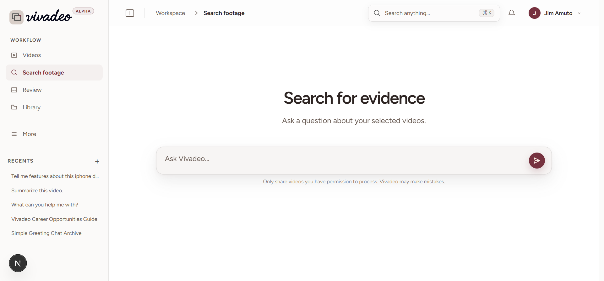

# Vivadeo

Vivadeo is a video archive you can search by asking questions about the footage.
Upload a video, wait for it to finish processing, then inspect answers with
timestamps and source evidence.

<p align="center">
  
</p>

## Run it locally

You will need Docker Desktop and `uv`.

```bash
uv sync
cp .env.example .env
docker compose -f docker-compose.dev.yml up -d
```

Open [http://localhost:3000](http://localhost:3000) and create an account.

The development stack mounts the source code into the containers. The web app
and API reload while you work. Set the required values in `.env` first,
especially the database, auth, storage, and email settings you plan to use.

To stop the stack:

```bash
docker compose -f docker-compose.dev.yml down
```

Avoid `down -v` unless you also want to remove the local database volume.

## Main pages

- `/dashboard/ingest` — upload a video or import a URL
- `/chat` — ask questions about ready videos
- `/dashboard/library` — browse and manage the archive
- `/dashboard/review` — verify evidence from search answers
- `/dashboard/billing` — view the workspace plan and billing details
- `/settings` — account, security, privacy, notifications, and answer settings

## Useful commands

Run the production-style local stack with the regular Compose file:

```bash
docker compose up -d
```

Run the backend tests:

```bash
uv run pytest
```

Run the web checks from `web/`:

```bash
npm.cmd ci
npm.cmd run typecheck
npm.cmd run build
```

The Python CLI is also available:

```bash
uv run vivadeo --help
uv run vivadeo index /path/to/video.mp4
uv run vivadeo search "red truck"
```

Run Jev Ultrafast from the Vivadeo repository:

```powershell
.\scripts\run-jev.ps1 `
  -Url http://localhost:3000/dashboard/library `
  -Goal "Open the library and stop when the video list is visible"
```

The runner uses the sibling Jev checkout and its own `.env`, reusing the
existing logged-in Chrome/CDP session without copying Jev or its credentials
into Vivadeo. It maps `VIVADEO_JEV_API_KEY` to Jev's `TYPESAFE_API_KEY`
automatically. The wrapper uses an ignored `.uv-cache-jev` cache by default so
Windows `uv` cache permissions do not prevent startup; set `UV_CACHE_DIR` to
override it. If diagnostic screenshots time out in the browser harness, the
wrapper retries the same flow without screenshots. Set
`VIVADEO_JEV_PROJECT_DIR` if the Jev checkout is elsewhere.

## Notes

Video processing happens in the background. A video can be searched only after
its job reaches the ready state. Only import videos you have permission to use.

More detailed setup and operations notes are in:

- [Architecture](ARCHITECTURE.md)
- [System design](SYSTEM-DESIGN.md)
- [Operations guide](VIVADEO.md)
- [Azure Blob storage](docs/AZURE-BLOB-STORAGE.md)
